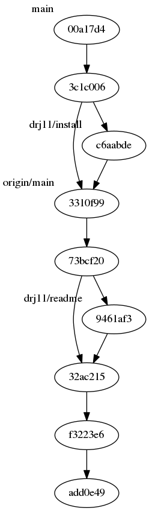

# gido — git into dot

Display `git` repo as graph network using `dot`.

Install:
    # from pypi
    python -m pip install gido

    # from a clone:
    python -m pip install .

Usage:
    gido

`gido` outputs [DOT graph description language](https://en.wikipedia.org/wiki/DOT_%28graph_description_language%29).
It is probably more useful to use `dot` to convert to PNG:

    gido | dot -Tpng > log.png

or, if using `kitty` or a similar terminal program capable of
displaying PNG files:

    gido | dot -Tpng | kitty icat

The result is a graphical image of the network graph of your git
repo:

∎
